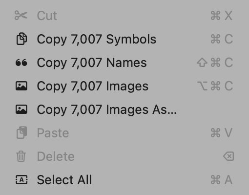

# SF Symbols Data Extraction

SF Symbols data can be copied from the SF Symbols app, downloadable from https://developer.apple.com/sf-symbols/

## Extraction Steps

1. Open SF Symbols app from `/Applications`
2. Select all symbols (Cmd+A)
3. Open Edit menu - you will see options like:
   - "Copy 7,007 Names"
   - "Copy 7,007 Symbols"



4. Click "Copy 7,007 Symbols" and paste into a text editor
5. Save as `symbols_x.x.txt` (where x.x is the SF Symbols version)
6. Click "Copy 7,007 Names" and paste into a text editor
7. Save as `names_x.x.txt`

The version number (e.g., 7.2) matches the SF Symbols app version.

## File Formats

### names_x.x.txt
Plain text file with one symbol name per line (e.g., `heart`, `star.fill`).

### symbols_x.x.txt
Raw binary file containing 4 bytes per symbol, encoded as modified UTF-8 (supplementary plane codepoints).

## Updating SF Symbols Version

To use a different version, change the `VERSION` variable in `build.sh`:

```bash
VERSION="7.3"
```

Then rebuild:

```bash
./build.sh
```
